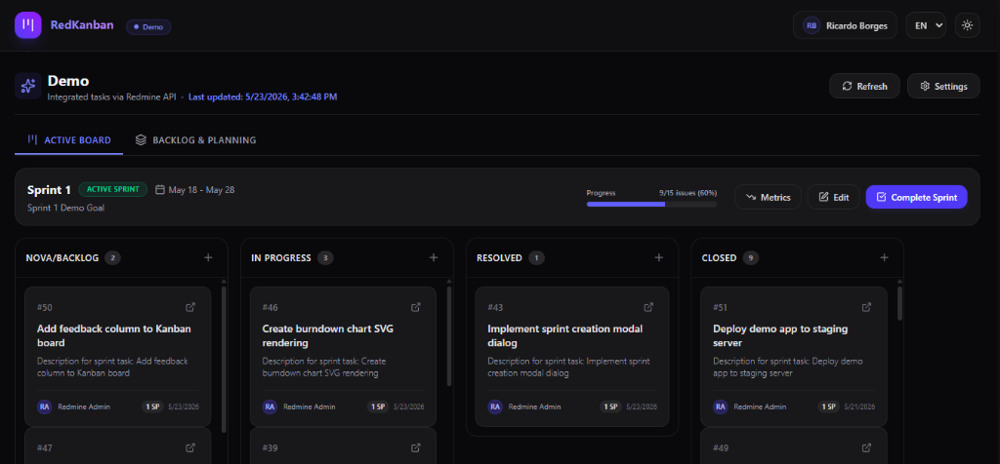
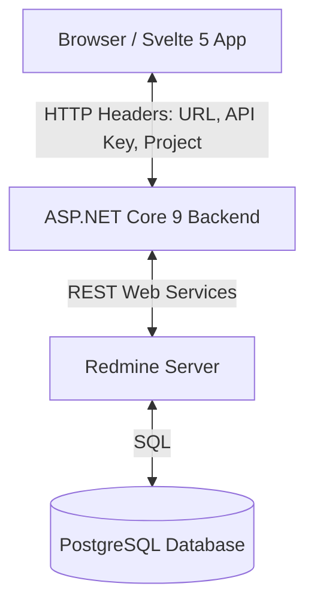

# RedKanban 

**RedKanban** is a modern Kanban board and agile management application integrated in real-time with **Redmine**. Developed with a focus on high performance and a premium visual experience, it allows you to plan sprints, manage the backlog, move tasks, and log progress directly to the Redmine APIs.

> [!TIP]
> **Live Demo:** You can test the application live without setting up anything locally! Access the web version here:
> 🔗 **[https://ricardoborges.github.io/RedKanban/](https://ricardoborges.github.io/RedKanban/)**

---

## 🎨 Visual Demo & Interface

The project features a modern and responsive interface, with full **Dark Mode** support, smooth transitions, and optimized asynchronous loading:

*   **Kanban Board:** Interactive card visualization in customizable columns, with drag-and-drop support, Story Points indicators, assignees, and dates.
*   **Sprint & Backlog Management:** Side backlog panel for planning the scope of active and future sprints.
*   **Smart Styling:** Visual options to highlight cards (e.g., painting cards whose tasks are assigned to you).



---

## 🌟 Key Features

*   **Direct Redmine REST API Integration:** The frontend does not store credentials in a centralized database; instead, it sends the Redmine URL and API Key via encrypted HTTP headers stored in the browser's LocalStorage, ensuring maximum security.
*   **Dynamic Flow Configuration (Columns):** Map any Redmine status to customized Kanban columns and reorder them freely.
*   **Agile Sprint Management:**
    *   Create Sprints (mapped to Redmine Versions).
    *   Set goals and start/end dates.
    *   Persistently store Sprint metadata inside the Redmine Version description in JSON format (`[SprintMetadata: ...]`), maintaining full compatibility without requiring database modifications in Redmine.
    *   Complete Sprints with smart migration of incomplete tasks to the next Sprint or the Backlog.
*   **Story Points Detection:** Automatically fetches the custom field named `"Story Points"` (or `"Pontos de História"`), with a fallback to Redmine's native `"Estimated Hours"` field.
*   **Advanced Task Interactions:** Modal view for details, reading history updates/comments (Journals), and adding new comments directly.
*   **Multi-language Support (i18n):** Default English interface with options to switch to Portuguese (PT-BR) and Spanish (ES) dynamically.

---

## 🛠️ Technology Stack

The project adopts a decoupled architecture (Frontend & Backend) built with modern technologies:

### Frontend
*   **Svelte 5** (Runes & Modern Reactivity)
*   **SvelteKit** & **Vite 8**
*   **Tailwind CSS v4** (Ultra-fast styling engine)
*   **Lucide Svelte** (Premium icon pack)

### Backend
*   **ASP.NET Core 9.0** (C#)
*   **Redmine.Net.Api** (SDK for Redmine integration)
*   **OpenAPI / Swagger** (Self-documented API endpoints)

### Infrastructure & Database
*   **Docker & Docker Compose**
*   **PostgreSQL 15** (for local Redmine)
*   **Redmine 5-alpine** (local development environment)

---

## 🧱 Architecture & Data Flow

The architecture is designed to be lightweight and secure. Below is the communication flow between components:



> [!NOTE]
> The ASP.NET Core API acts as a high-performance smart proxy. It enriches raw Redmine data (such as parsing sprint metadata from version descriptions) before returning it formatted to Svelte.

---

## 🚀 Running the Project Locally

Make sure you have **Docker** and **Docker Compose** installed.

### 1. Start the Containers

In the repository root, run the command to build and initialize all services:

```powershell
docker-compose up --build -d
```

### 2. Access the Services

Once fully initialized, the following ports and services will be available:

*   **RedKanban (Frontend):** [http://localhost:5173](http://localhost:5173)
*   **RedKanban API (Backend):** [http://localhost:5000](http://localhost:5000)
    *   *OpenAPI Docs:* [http://localhost:5000/openapi/v1.json](http://localhost:5000/openapi/v1.json)
*   **Local Redmine:** [http://localhost:8300](http://localhost:8300)

---

## ⚙️ Initial Redmine Configuration

To integrate RedKanban with your Redmine server (local or enterprise), ensure you:

1.  **Enable REST API Access:**
    *   In Redmine, go to **Administration** -> **Settings** -> **API** tab.
    *   Check **"Enable REST web service"** and save.
2.  **Get Your API Access Key:**
    *   Go to **My Account** (top-right corner).
    *   In the right sidebar under "API access key", click **Show** and copy the generated token.
3.  **Configure Story Points (Optional):**
    *   To use story points instead of estimated hours, create a custom field for issues in Redmine named `"Story Points"` (or `"Pontos de História"`/`"Pontos de Historia"`) of type `Integer` or `Float`.
    *   If this custom field is not found, RedKanban will fallback to the default **Estimated Hours** field for card points estimation.

---

## 📂 Directory Structure

```text
RedKanban/
├── docker-compose.yml          # Container definitions and orchestration
├── LICENSE                     # MIT License
├── README.md                   # This documentation (English)
└── src/
    ├── backend/                # ASP.NET Core 9 REST API
    │   ├── Controllers/        # KanbanController (Endpoints and business logic)
    │   ├── Services/           # Connection providers and Redmine managers
    │   ├── Models/             # DTOs and communication models
    │   ├── Program.cs          # API entry point
    │   └── Dockerfile          # Multi-stage production build for backend
    └── frontend/               # SPA Svelte 5 + Tailwind CSS v4
        ├── src/
        │   ├── lib/
        │   │   ├── components/ # Visual components (KanbanBoard, Backlog, Modales, etc.)
        │   │   └── services/   # api.ts (Backend API calls)
        │   └── routes/         # SvelteKit pages (+page.svelte)
        ├── package.json        # Node.json package configuration
        └── Dockerfile          # Dev/prod Svelte web application container
```

---

## 📜 License

This project is licensed under the [MIT License](file:///d:/dev/github/RedKanban/LICENSE).
